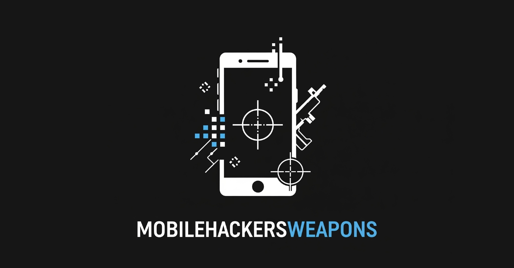

<h1 align="center">
   
  
   
  
  
  
  
  
  
</h1>
A collection of cool tools used by Mobile hackers. Happy hacking , Happy bug-hunting

## Family project

## Table of Contents
- [Weapons](#weapons)
- [Contribute](/CONTRIBUTING.md)
- [Thanks to contributor](#thanks-to-contributor)

## Weapons
| OS | Type | Name | Description | Popularity | Language |
| ---------- | :---------- | :---------- | :----------: | :----------: | :----------: |
| All | Analysis | [RMS-Runtime-Mobile-Security](https://github.com/m0bilesecurity/RMS-Runtime-Mobile-Security) | Runtime Mobile Security (RMS) 📱🔥  - is a powerful web interface that helps you to manipulate Android and iOS Apps at Runtime |  |  |
| All | Analysis | [flipper](https://github.com/facebook/flipper) | A desktop debugging platform for mobile developers. |  |  |
| All | Analysis | [scrounger](https://github.com/nettitude/scrounger) | Mobile application testing toolkit |  |  |
| All | Pentest | [metasploit-framework](https://github.com/rapid7/metasploit-framework) | Metasploit Framework |  |  |
| All | Proxy  | [BurpSuite](https://portswigger.net/burp) |  The BurpSuite||
| All | Proxy | [hetty](https://github.com/dstotijn/hetty) | Hetty is an HTTP toolkit for security research. |  |  |
| All | Proxy | [httptoolkit](https://github.com/httptoolkit/httptoolkit) | HTTP Toolkit is a beautiful & open-source tool for debugging, testing and building with HTTP(S) on Windows, Linux & Mac |  |  |
| All | Proxy | [proxify](https://github.com/projectdiscovery/proxify) | Swiss Army knife Proxy tool for HTTP/HTTPS traffic capture, manipulation, and replay on the go. |  |  |
| All | Proxy | [zaproxy](https://github.com/zaproxy/zaproxy) | The OWASP ZAP core project |  |  |
| All | RE | [diff-gui](https://github.com/antojoseph/diff-gui) | GUI for Frida -Scripts |  |  |
| All | RE | [frida](https://github.com/frida/frida) | Clone this repo to build Frida |  |  |
| All | RE | [frida-tools](https://github.com/frida/frida-tools) | Frida CLI tools |  |  |
| All | RE | [fridump](https://github.com/Nightbringer21/fridump) | A universal memory dumper using Frida |  |  |
| All | RE | [ghidra](https://github.com/NationalSecurityAgency/ghidra) | Ghidra is a software reverse engineering (SRE) framework |  |  |
| All | SCRIPTS | [frida-gadget](https://github.com/ksg97031/frida-gadget) | frida-gadget is a tool that can be used to patch APKs in order to utilize the Frida gadget. |  |  |
| All | SCRIPTS | [frida-scripts](https://github.com/0xdea/frida-scripts) | A collection of my Frida.re instrumentation scripts to facilitate reverse engineering of mobile apps. |  |  |
| All | Scanner | [Mobile-Security-Framework-MobSF](https://github.com/MobSF/Mobile-Security-Framework-MobSF) | Mobile Security Framework (MobSF) is an automated, all-in-one mobile application (Android/iOS/Windows) pen-testing, malware analysis and security assessment framework capable of performing static and dynamic analysis. |  |  |
| All | Scanner | [StaCoAn](https://github.com/vincentcox/StaCoAn) | StaCoAn is a crossplatform tool which aids developers, bugbounty hunters and ethical hackers performing static code analysis on mobile applications. |  |  |
| All | Utils | [watchman](https://github.com/facebook/watchman) | Watches files and records, or triggers actions, when they change. |  |  |
| Android | Analysis | [apkleaks](https://github.com/dwisiswant0/apkleaks) | Scanning APK file for URIs, endpoints & secrets. |  |  |
| Android | Analysis | [drozer](https://github.com/FSecureLABS/drozer) | The Leading Security Assessment Framework for Android. |  |  |
| Android | Device | [scrcpy](https://github.com/Genymobile/scrcpy) | Display and control your Android device |  |  |
| Android | Discovery | [PortAuthority](https://github.com/aaronjwood/PortAuthority) | A handy systems and security-focused tool, Port Authority is a very fast Android port scanner. Port Authority also allows you to quickly discover hosts on your network and will display useful network information about your device and other hosts. |  |  |
| Android | Monitor | [Hijacker](https://github.com/chrisk44/Hijacker) | Aircrack, Airodump, Aireplay, MDK3 and Reaver GUI Application for Android |  |  |
| Android | Monitor | [PCAPdroid](https://github.com/emanuele-f/PCAPdroid) | No-root network monitor, firewall and PCAP dumper for Android |  |  |
| Android | NFC | [nfcgate](https://github.com/nfcgate/nfcgate) | An NFC research toolkit application for Android |  |  |
| Android | Pentest  | [Kali NetHunter](https://gitlab.com/kalilinux/nethunter/build-scripts/kali-nethunter-project) |  Mobile Penetration Testing Platform||
| Android | RE | [Apktool](https://github.com/iBotPeaches/Apktool) | A tool for reverse engineering Android apk files |  |  |
| Android | RE  | [JEB](https://www.pnfsoftware.com/jeb/) |  reverse-engineering platform to perform disassembly, decompilation, debugging, and analysis of code and document files, manually or as part of an analysis pipeline.||
| Android | RE | [Smali-CFGs](https://github.com/EugenioDelfa/Smali-CFGs) | Smali Control Flow Graph's |  |  |
| Android | RE | [androguard](https://github.com/androguard/androguard) | Reverse engineering, Malware and goodware analysis of Android applications ... and more (ninja !) |  |  |
| Android | RE | [apkx](https://github.com/b-mueller/apkx) | One-Step APK Decompilation With Multiple Backends |  |  |
| Android | RE | [btrace](https://github.com/bytedance/btrace) | 🔥🔥 btrace(AKA RheaTrace) is a high performance Android trace tool which is based on Systrace, it support to define custom events automatically during building apk and using bhook to provider more native events like IO. |  |  |
| Android | RE | [bytecode-viewer](https://github.com/Konloch/bytecode-viewer/) | A Java 8+ Jar & Android APK Reverse Engineering Suite (Decompiler, Editor, Debugger & More) |  |  |
| Android | RE | [dex-oracle](https://github.com/CalebFenton/dex-oracle) | A pattern based Dalvik deobfuscator which uses limited execution to improve semantic analysis |  |  |
| Android | RE | [dex2jar](https://github.com/pxb1988/dex2jar) | Tools to work with android .dex and java .class files |  |  |
| Android | RE | [enjarify](https://github.com/Storyyeller/enjarify) | Enjarify is a tool for translating Dalvik bytecode to equivalent Java bytecode. This allows Java analysis tools to analyze Android applications. |  |  |
| Android | RE | [jadx](https://github.com/skylot/jadx) | Dex to Java decompiler |  |  |
| Android | RE | [jd-gui](https://github.com/java-decompiler/jd-gui) | A standalone Java Decompiler GUI |  |  |
| Android | RE | [procyon](https://github.com/mstrobel/procyon) | Procyon is a suite of Java metaprogramming tools, including a rich reflection API, a LINQ-inspired expression tree API for runtime code generation, and a Java decompiler. |  |  |
| Android | Scanner | [qark](https://github.com/linkedin/qark) | Tool to look for several security related Android application vulnerabilities |  |  |
| Android | Target | [PlaystoreDownloader](https://github.com/ClaudiuGeorgiu/PlaystoreDownloader) | A command line tool to download Android applications directly from the Google Play Store by specifying their package name (an initial one-time configuration is required) |  |  |
| Android | Target | [googleplay](https://github.com/89z/googleplay) | Download APK from Google Play or send API requests |  |  |
| Android | Target | [gplaycli](https://github.com/matlink/gplaycli) | Google Play Downloader via Command line |  |  |
| Android | Target | [gplaydl](https://github.com/rehmatworks/gplaydl) | Command Line Google Play APK downloader. Download APK files to your PC directly from Google Play Store. |  |  |
| Android | Utils | [Magisk](https://github.com/topjohnwu/Magisk) | The Magic Mask for Android |  |  |
| Android | Utils | [behe-keyboard](https://github.com/VladThodo/behe-keyboard) | A lightweight hacking & programming keyboard with material design |  |  |
| Android | Utils | [termux-app](https://github.com/termux/termux-app) | Termux - a terminal emulator application for Android OS extendible by variety of packages. |  |  |
| iOS | Analysis  | [iFunBox](http://www.i-funbox.com/) |  General file management software for iPhone and other Apple products||
| iOS | Analysis | [iblessing](https://github.com/Soulghost/iblessing) | iblessing is an iOS security exploiting toolkit, it mainly includes application information collection, static analysis and dynamic analysis. It can be used for reverse engineering, binary analysis and vulnerability mining. |  |  |
| iOS | Analysis | [needle](https://github.com/FSecureLABS/needle) | The iOS Security Testing Framework |  |  |
| iOS | Analysis | [objection](https://github.com/sensepost/objection) | 📱 objection - runtime mobile exploration |  |  |
| iOS | Bluetooth | [toothpicker](https://github.com/seemoo-lab/toothpicker) | ToothPicker is an in-process, coverage-guided fuzzer for iOS. for iOS Bluetooth |  |  |
| iOS | Bypass Jailbreak  | [A-Bypass](https://www.ios-repo-updates.com/repository/baw-repo/package/com.rpgfarm.a-bypass/) |  Super Jailbreak detection bypass!||
| iOS | Bypass Jailbreak | [FlyJB-X](https://github.com/XsF1re/FlyJB-X) | You can HIDE Doing jailbreak your iDevice. |  |  |
| iOS | Bypass Jailbreak  | [HideJB](http://cydia.saurik.com/package/com.thuthuatjb.hidejb/) |  a tweak has the ability to skip jailbreak detection on iOS apps.||
| iOS | Bypass Jailbreak  | [Liberty](https://yalujailbreak.net/liberty/) |  Bypass Jailbreak and SSL Pinning||
| iOS | Inject | [bfinject](https://github.com/BishopFox/bfinject) | Dylib injection for iOS 11.0 - 11.1.2 with LiberiOS and Electra jailbreaks |  |  |
| iOS | RE | [Clutch](https://github.com/KJCracks/Clutch) | Fast iOS executable dumper |  |  |
| iOS | RE | [class-dump](https://github.com/nygard/class-dump) | Generate Objective-C headers from Mach-O files. |  |  |
| iOS | RE | [frida-ios-dump](https://github.com/AloneMonkey/frida-ios-dump) | pull decrypted ipa from jailbreak device |  |  |
| iOS | RE | [iRET](https://github.com/S3Jensen/iRET) | iOS Reverse Engineering Toolkit. |  |  |
| iOS | RE | [iSpy](https://github.com/BishopFox/iSpy) | A reverse engineering framework for iOS |  |  |
| iOS | RE | [ipsw](https://github.com/blacktop/ipsw) | iOS/macOS Research Swiss Army Knife |  |  |
| iOS | RE | [momdec](https://github.com/atomicbird/momdec) | Core Data Managed Object Model Decompiler |  |  |
| iOS | Target | [ipainstaller](https://github.com/autopear/ipainstaller) | Install IPA from command line |  |  |
| iOS | Unpinning | [MEDUZA](https://github.com/kov4l3nko/MEDUZA) | A more or less universal SSL unpinning tool for iOS |  |  |
| iOS | Unpinning | [ssl-kill-switch2](https://github.com/nabla-c0d3/ssl-kill-switch2) | Blackbox tool to disable SSL certificate validation - including certificate pinning - within iOS and OS X Apps |  |  |
| iOS | Utils | [idb](https://github.com/facebook/idb) | idb is a flexible command line interface for automating iOS simulators and devices |  |  |

## Thanks to (Contributor)
I would like to thank everyone who helped with this project 👍😎

